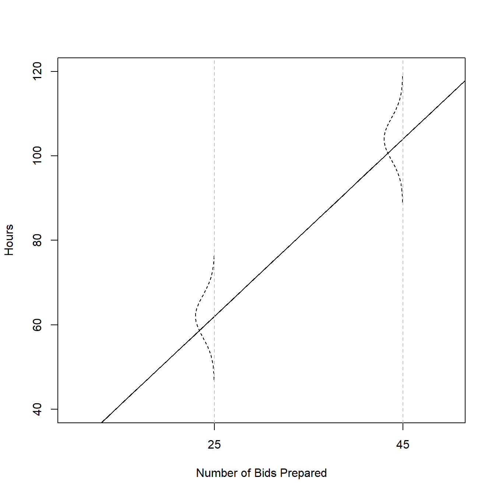
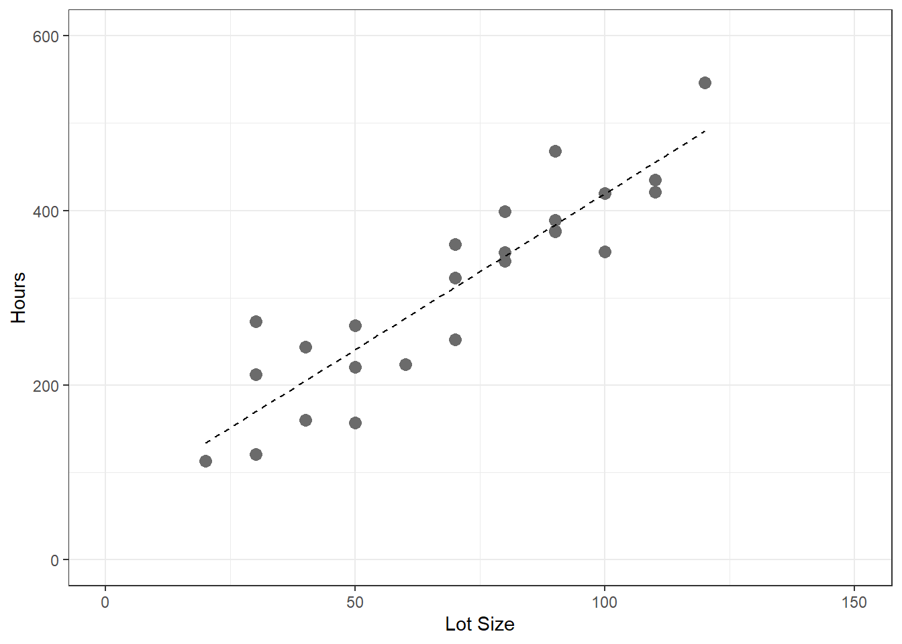

# Linear Regression with One Predictor Variable {#ch1}


## Relations between Variables

### Example 1


```r
require(here)

fig1.2 <- read.csv(here('/data/fig1.2.csv/'),header=FALSE)

require(ggplot2)

ggplot(fig1.2,aes(x=V1,y=V2))+
  geom_point(size=4,col='gray42')+
  geom_smooth(method=lm,se=FALSE,lty=2,col='black')+
  xlim(55,100)+
  ylim(55,100)+
  xlab('Midyear Evaluation')+
  ylab('Year-End Evaluation')+
  theme_bw()
```


### Example 2


```r
fig1.3 <- read.csv(here('/data/fig1.3.csv/'),header=FALSE)

ggplot(fig1.3,aes(x=V1,y=V2))+
  geom_point(size=4,col='gray42')+
  geom_smooth(method=lm,formula = y ~ x + I(x^2), se=FALSE,lty=2,col='black')+
  xlim(7.5,25)+
  ylim(1,30)+
  xlab('Age')+
  ylab('Stereoid Level')+
  theme_bw()
```


## Regression Model an Their Uses

## Simple Linear Regression Model with Distributions of Error Terms Unspecified

### Example (page 10)

$$Y_i = 9.5 + 2.1X_i + \epsilon_i$$

```r
b0 = 9.5
b1 = 2.1
        
x = 0:70
        
mean = b0 + b1*x
    
err.sd = 5
        
  plot(x,mean,type="l",
       ylim=c(40,120),
       xlim=c(10,50),
       cex=1,
       pch=19,
       xlab="Number of Bids Prepared",
       ylab="Hours",
       xaxt='n')
        
  axis(side=1,at=c(0,25,45))
  abline(b0,b1)
        
  dens = dnorm(seq(-3,3,.01),0,1)

  for(i in c(26,46)){
            
    x. = x[i] - 5*dens
    y. = mean[i]+seq(-3,3,.01)*err.sd
    points(x.,y.,type="l",lty=2)
    abline(v=x[i],lty=2,col="gray")
  }
```



## Data for Regression Analysis

## Overview of Steps in Regression Analysis

## Estimation of Regression Function

### Example (page 15)


```r
Age      <- c(20,55,30)
Attempts <- c(5, 12, 10)

fig1.9 <- data.frame(Age=Age,Attempts=Attempts)

ggplot(data= fig1.9, aes(x=Age,y=Attempts))+
	geom_point(size=4,color='gray42')+
	xlim(c(10,60))+
	ylim(c(0,15))+
  theme_bw()+
	geom_hline(yintercept = 9)+
	geom_segment(x = fig1.9[1,1], y = fig1.9[1,2], xend = fig1.9[1,1], yend = 9)+
  geom_segment(x = fig1.9[2,1], y = fig1.9[2,2], xend = fig1.9[2,1], yend = 9)+
  geom_segment(x = fig1.9[3,1], y = fig1.9[3,2], xend = fig1.9[3,1], yend = 9)+
	xlab('Age')+
	ylab('Attempts')
```


```r
# Sum of Squared Deviations 

sum((Attempts - 9)^2)
```

```
[1] 26
```


```r
mod <- lm(Attempts ~ 1 + Age,d=fig1.9)

ggplot(data= fig1.9, aes(x=Age,y=Attempts))+
	geom_point(size=4,color='gray42')+
  geom_abline(intercept = coef(mod)[1],slope=coef(mod)[2])+
	xlim(c(10,60))+
	ylim(c(0,15))+
  theme_bw()+
	geom_segment(x = fig1.9[1,1], y = fig1.9[1,2], xend = fig1.9[1,1], 
	             yend = predict(mod, newdata = data.frame(Age=c(fig1.9[1,1]))))+
	geom_segment(x = fig1.9[2,1], y = fig1.9[2,2], xend = fig1.9[2,1], 
	             yend = predict(mod, newdata = data.frame(Age=c(fig1.9[2,1]))))+
	geom_segment(x = fig1.9[3,1], y = fig1.9[3,2], xend = fig1.9[3,1], 
	             yend = predict(mod, newdata = data.frame(Age=c(fig1.9[3,1]))))+
	xlab('Age')+
	ylab('Attempts')
```


```r
# Model predictions

predict(mod)
```

```
     1      2      3 
 6.346 12.538  8.115 
```

```r
# Model Residuals

resid(mod)
```

```
      1       2       3 
-1.3462 -0.5385  1.8846 
```

```r
# Sum of Squared Deviations 

sum((Attempts - predict(mod))^2)
```

```
[1] 5.654
```

```r
sum(resid(mod)^2)
```

```
[1] 5.654
```

### Example (page 19)


```r
table1.1 <- read.table(here('/data/CH01TA01.txt/'),header=FALSE)

colnames(table1.1) <- c('lot.size','work.hours')

table1.1
```

```
   lot.size work.hours
1        80        399
2        30        121
3        50        221
4        90        376
5        70        361
6        60        224
7       120        546
8        80        352
9       100        353
10       50        157
11       40        160
12       70        252
13       90        389
14       20        113
15      110        435
16      100        420
17       30        212
18       50        268
19       90        377
20      110        421
21       30        273
22       90        468
23       40        244
24       80        342
25       70        323
```


```r
ggplot(table1.1,aes(x=lot.size,y=work.hours))+
  geom_point(size=3,col='gray42')+
  geom_smooth(method=lm,se=FALSE,lty=2,lwd=0.5,col='black')+
  xlim(0,150)+
  ylim(0,600)+
  xlab('Lot Size')+
  ylab('Hours')+
  theme_bw()
```




```r
require(lm.beta)
require(car)

mod <- lm(work.hours ~ 1 + lot.size,d=table1.1)

Anova(mod,type=3)
```

```
Anova Table (Type III tests)

Response: work.hours
            Sum Sq Df F value        Pr(>F)    
(Intercept)  13530  1    5.68         0.026 *  
lot.size    252378  1  105.88 0.00000000044 ***
Residuals    54825 23                          
---
Signif. codes:  0 '***' 0.001 '**' 0.01 '*' 0.05 '.' 0.1 ' ' 1
```

```r
summary(mod)
```

```

Call:
lm(formula = work.hours ~ 1 + lot.size, data = table1.1)

Residuals:
   Min     1Q Median     3Q    Max 
-83.88 -34.09  -5.98  38.83 103.53 

Coefficients:
            Estimate Std. Error t value      Pr(>|t|)    
(Intercept)   62.366     26.177    2.38         0.026 *  
lot.size       3.570      0.347   10.29 0.00000000044 ***
---
Signif. codes:  0 '***' 0.001 '**' 0.01 '*' 0.05 '.' 0.1 ' ' 1

Residual standard error: 48.8 on 23 degrees of freedom
Multiple R-squared:  0.822,	Adjusted R-squared:  0.814 
F-statistic:  106 on 1 and 23 DF,  p-value: 0.000000000445
```

```r
coef(mod)
```

```
(Intercept)    lot.size 
      62.37        3.57 
```


```r
table1.1$x_xbar <- table1.1$lot.size - mean(table1.1$lot.size)
table1.1$y_ybar <- table1.1$work.hours - mean(table1.1$work.hours)
table1.1$x_xbar_y_ybar <- table1.1$x_xbar*table1.1$y_ybar
table1.1$x_xbar.sq <- table1.1$x_xbar^2
table1.1$y_ybar.sq <- table1.1$y_ybar^2

table1.1
```

```
   lot.size work.hours x_xbar  y_ybar x_xbar_y_ybar x_xbar.sq y_ybar.sq
1        80        399     10   86.72         867.2       100    7520.4
2        30        121    -40 -191.28        7651.2      1600   36588.0
3        50        221    -20  -91.28        1825.6       400    8332.0
4        90        376     20   63.72        1274.4       400    4060.2
5        70        361      0   48.72           0.0         0    2373.6
6        60        224    -10  -88.28         882.8       100    7793.4
7       120        546     50  233.72       11686.0      2500   54625.0
8        80        352     10   39.72         397.2       100    1577.7
9       100        353     30   40.72        1221.6       900    1658.1
10       50        157    -20 -155.28        3105.6       400   24111.9
11       40        160    -30 -152.28        4568.4       900   23189.2
12       70        252      0  -60.28           0.0         0    3633.7
13       90        389     20   76.72        1534.4       400    5886.0
14       20        113    -50 -199.28        9964.0      2500   39712.5
15      110        435     40  122.72        4908.8      1600   15060.2
16      100        420     30  107.72        3231.6       900   11603.6
17       30        212    -40 -100.28        4011.2      1600   10056.1
18       50        268    -20  -44.28         885.6       400    1960.7
19       90        377     20   64.72        1294.4       400    4188.7
20      110        421     40  108.72        4348.8      1600   11820.0
21       30        273    -40  -39.28        1571.2      1600    1542.9
22       90        468     20  155.72        3114.4       400   24248.7
23       40        244    -30  -68.28        2048.4       900    4662.2
24       80        342     10   29.72         297.2       100     883.3
25       70        323      0   10.72           0.0         0     114.9
```


```r
b1 = sum(table1.1$x_xbar_y_ybar)/sum(table1.1$x_xbar.sq)
b1
```

```
[1] 3.57
```

```r
b0 = mean(table1.1$work.hours) - b1*mean(table1.1$lot.size)
b0
```

```
[1] 62.37
```


### Example (page 21)

$$ \hat{Y} = 62.37 + 35702*X$$


```r
predict(mod, newdata = data.frame(lot.size=65))
```

```
    1 
294.4 
```

### Table 1.2 (page 22)


```r
table1.1 <- read.table(here('/data/CH01TA01.txt/'),header=FALSE)
colnames(table1.1) <- c('lot.size','work.hours')

mod <- lm(work.hours ~ 1 + lot.size,d=table1.1)

table1.1$predicted <- predict(mod)
table1.1$residuals <- resid(mod)
table1.1$residuals.squared <- resid(mod)^2

table1.1
```

```
   lot.size work.hours predicted residuals residuals.squared
1        80        399     348.0   51.0180         2602.8343
2        30        121     169.5  -48.4719         2349.5270
3        50        221     240.9  -19.8760          395.0538
4        90        376     383.7   -7.6840           59.0445
5        70        361     312.3   48.7200         2373.6384
6        60        224     276.6  -52.5780         2764.4440
7       120        546     490.8   55.2099         3048.1329
8        80        352     348.0    4.0180           16.1442
9       100        353     419.4  -66.3861         4407.1090
10       50        157     240.9  -83.8760         7035.1766
11       40        160     205.2  -45.1739         2040.6848
12       70        252     312.3  -60.2800         3633.6784
13       90        389     383.7    5.3160           28.2594
14       20        113     133.8  -20.7699          431.3887
15      110        435     455.1  -20.0881          403.5310
16      100        420     419.4    0.6139            0.3769
17       30        212     169.5   42.5281         1808.6377
18       50        268     240.9   27.1240          735.7136
19       90        377     383.7   -6.6840           44.6764
20      110        421     455.1  -34.0881         1161.9973
21       30        273     169.5  103.5281        10718.0635
22       90        468     383.7   84.3160         7109.1810
23       40        244     205.2   38.8261         1507.4630
24       80        342     348.0   -5.9820           35.7846
25       70        323     312.3   10.7200          114.9184
```


### Alternative Model with Mean Centering (page 22)


```r
table1.1 <- read.table(here('/data/CH01TA01.txt/'),header=FALSE)
colnames(table1.1) <- c('lot.size','work.hours')

table1.1$lot.size_centered <- table1.1$lot.size - mean(table1.1$lot.size)

mod <- lm(work.hours ~ 1 + lot.size_centered,d=table1.1)

Anova(mod,type=3)
```

```
Anova Table (Type III tests)

Response: work.hours
                   Sum Sq Df F value               Pr(>F)    
(Intercept)       2437970  1    1023 < 0.0000000000000002 ***
lot.size_centered  252378  1     106        0.00000000044 ***
Residuals           54825 23                                 
---
Signif. codes:  0 '***' 0.001 '**' 0.01 '*' 0.05 '.' 0.1 ' ' 1
```

```r
summary(mod)
```

```

Call:
lm(formula = work.hours ~ 1 + lot.size_centered, data = table1.1)

Residuals:
   Min     1Q Median     3Q    Max 
-83.88 -34.09  -5.98  38.83 103.53 

Coefficients:
                  Estimate Std. Error t value             Pr(>|t|)    
(Intercept)        312.280      9.765    32.0 < 0.0000000000000002 ***
lot.size_centered    3.570      0.347    10.3        0.00000000044 ***
---
Signif. codes:  0 '***' 0.001 '**' 0.01 '*' 0.05 '.' 0.1 ' ' 1

Residual standard error: 48.8 on 23 degrees of freedom
Multiple R-squared:  0.822,	Adjusted R-squared:  0.814 
F-statistic:  106 on 1 and 23 DF,  p-value: 0.000000000445
```

```r
coef(mod)
```

```
      (Intercept) lot.size_centered 
           312.28              3.57 
```

## Estimation of Error Terms Variance


```r
table1.1 <- read.table(here('/data/CH01TA01.txt/'),header=FALSE)
colnames(table1.1) <- c('lot.size','work.hours')

mod <- lm(work.hours ~ 1 + lot.size,d=table1.1)

table1.1$predicted <- predict(mod)
table1.1$residuals <- resid(mod)
table1.1$residuals.squared <- resid(mod)^2

sse = sum(table1.1$residuals.squared)
sse
```

```
[1] 54825
```

```r
mse = sum(table1.1$residuals.squared)/(nrow(table1.1)-2)
mse 
```

```
[1] 2384
```

```r
sqrt(mse)
```

```
[1] 48.82
```

## Normal Error Regression Model

### Least Square Estimation


```r
table1.1 <- read.table(here('/data/CH01TA01.txt/'),header=FALSE)
colnames(table1.1) <- c('lot.size','work.hours')

beta0 <- seq(50,75,.1)
beta1 <- seq(1,6,.01)

ols <- expand.grid(beta0,beta1)
colnames(ols) <- c('beta0','beta1')
ols$ssr <- NA

for(i in 1:nrow(ols)){
	p = ols[i,1] + ols[i,2]*table1.1$lot.size
	ols[i,3] = sum((table1.1$work.hours - p)^2)
}

require(lattice)

wireframe(ssr ~ beta0 * beta1,
          data = ols,
          shade=TRUE,
          screen = list(z = 40, x = -60, y=0),
	    scales = list(arrows=FALSE),
	    xlab = expression(beta[0]), 
	    ylab = expression(beta[1]), 
	    zlab = "SSR")

ols[which.min(ols$ssr),]
```


```
      beta0 beta1   ssr
64632  62.4  3.57 54825
```


### Maximum Likelihood Estimation


```r
table1.1 <- read.table(here('/data/CH01TA01.txt/'),header=FALSE)
colnames(table1.1) <- c('lot.size','work.hours')

beta0 <- seq(50,75,.1)
beta1 <- seq(1,6,.01)

mle <- expand.grid(beta0,beta1)
colnames(mle) <- c('beta0','beta1')
mle$loglikelihood <- NA

mse = 2383 # assumed to be known

for(i in 1:nrow(mle)){
	p = ols[i,1] + ols[i,2]*table1.1$lot.size
	mle[i,3] = 	sum(log(dnorm((table1.1$work.hours - p)/sqrt(mse))))
}

wireframe(loglikelihood ~ beta0 * beta1,
          data = mle,
          shade=TRUE,
          screen = list(z = 40, x = -60, y=0),
          scales = list(arrows=FALSE),
          xlab = expression(beta[0]), 
          ylab = expression(beta[1]), 
          zlab = "Loglikelihood")

mle[which.max(mle$loglikelihood),]
```


```
      beta0 beta1 loglikelihood
64632  62.4  3.57        -34.48
```


## Problems

### 1.1 

No.

### 1.2

functional

### 1.3

?

### 1.4

Error component in statistical models

### 1.5

No. The expected value of Y should be the average, so there shouldn't be an error part.

$$E(Y_i) = \beta_0 + \beta_1X_i$$

### 1.6

$$Y_i = 200 + 5X_i + \epsilon_i, \epsilon_i \sim N(0,4)$$
$\beta_0 = 200$ is the expected value of Y when X = 0,
$\beta_1 = 5$ is the expected change in the value of Y for one unit increase in X


```r
b0 = 200
b1 = 5
        
x = 0:70
        
mean = b0 + b1*x
    
err.sd = 4
        
  plot(x,mean,type="l",
       ylim=c(150,450),
       xlim=c(0,50),
       cex=1,
       pch=19,
       xlab="X",
       ylab="Y",
       xaxt='n')
        
  axis(side=1,at=c(10,20,40))
  abline(b0,b1)
        
  dens = dnorm(seq(-3,3,.01),0,1)

  for(i in c(11,21,41)){
            
    x. = x[i] - 5*dens
    y. = mean[i]+seq(-3,3,.01)*err.sd
    points(x.,y.,type="l",lty=2)
    abline(v=x[i],lty=2,col="gray")
  }
```


### 1.7

$$Y_i = 100 + 20X_i + \epsilon_i, \epsilon_i \sim N(0,5)$$

For $X=5$, $\mu_Y = 100 + 100*5 = 200$ and $\sigma_Y = 5$. Assuming the errors are normally distributed, the probability that Y will be between 195 and 205 is about 68%. 

### 1.8

No, the expected value for the new observations would be still 104 unless you re-fit the model with the addition of this new observation.

### 1.9 

?

### 1.10

Need to see the exact coefficients for an accurate interpretation

### 1.11

No, slope only shows the relationship between the production output before and after training. The intercept difference (20) reflects the training effect. So, training increased the production output by 20.

### 1.12

a. observational, no information that the senior citizens are randomly assigned to different levels of physical activity

b. not accurate, can't make a causal statement

c. ??

d. random assignment to different levels of physical activity

### 1.13

a. observational

b. not accurate, can't make a causal statement

c. ??

d. random assignment to different levels of physical activity

### 1.14


```r
set.seed(1234)

a <- data.frame(cbind(1:16,runif(16,0,1)))

a <- a[order(a[,2]),]

a$gr <- c(1,1,1,1,2,2,2,2,3,3,3,3,4,4,4,4)

a
```

```
   X1       X2 gr
7   7 0.009496  1
1   1 0.113703  1
8   8 0.232551  1
13 13 0.282734  1
15 15 0.292316  2
10 10 0.514251  2
12 12 0.544975  2
3   3 0.609275  2
2   2 0.622299  3
4   4 0.623379  3
6   6 0.640311  3
9   9 0.666084  3
11 11 0.693591  4
16 16 0.837296  4
5   5 0.860915  4
14 14 0.923433  4
```


```r
# Simulation code to demonstrate if the above procedure works as expected

gr <- vector('list',100000)

for(i in 1:100000){
  a <- data.frame(cbind(1:16,runif(16,0,1)))
  a <- a[order(a[,2]),]
  a$gr <- c(1,1,1,1,2,2,2,2,3,3,3,3,4,4,4,4)
  gr[[i]] = a
}

assg <- c()

k <- 4

for(i in 1:100000){
  assg[i] <- gr[[i]][which(gr[[i]][,1]==k),3]
}

table(assg)
```


### 1.15


```r
set.seed(1234)

a <- data.frame(cbind(1:20,runif(20,0,1)))

a <- a[order(a[,2]),]

a$gr <- c(1,1,1,1,2,2,2,2,3,3,3,3,4,4,4,4,5,5,5,5)

a
```

```
   X1       X2 gr
7   7 0.009496  1
1   1 0.113703  1
19 19 0.186723  1
20 20 0.232226  1
8   8 0.232551  2
18 18 0.266821  2
13 13 0.282734  2
17 17 0.286223  2
15 15 0.292316  3
10 10 0.514251  3
12 12 0.544975  3
3   3 0.609275  3
2   2 0.622299  4
4   4 0.623379  4
6   6 0.640311  4
9   9 0.666084  4
11 11 0.693591  5
16 16 0.837296  5
5   5 0.860915  5
14 14 0.923433  5
```

### 1.16

No. Least squres method doesn't care about the distribution of Y. It is still BLUE. No assumption is needed until one decides to make an inference

### 1.17

yes. why not?

### 1.18

It is not necessary that the errors will sum to zero at the population. Even the average error in population is different than zero, the residuals from a regression at the sample level can be equal to zero. See below.


```r
set.seed(1234)

# Population

  b0 <- 200
  b1 <- 5
  sigma <- 5

  x   <- rnorm(10000,0,1)
  err <- rnorm(10000,50,5)
  y   <- b0+b1+err

# A random sample with size 200
  
s <- sample(1:10000,200)

s.x <- x[s]
s.y <- y[s]

fit <- lm(s.y ~ s.x)

summary(fit)
```

```

Call:
lm(formula = s.y ~ s.x)

Residuals:
    Min      1Q  Median      3Q     Max 
-17.404  -2.695   0.236   3.044  13.149 

Coefficients:
            Estimate Std. Error t value            Pr(>|t|)    
(Intercept)  254.808      0.346  735.87 <0.0000000000000002 ***
s.x            0.299      0.350    0.85                0.39    
---
Signif. codes:  0 '***' 0.001 '**' 0.01 '*' 0.05 '.' 0.1 ' ' 1

Residual standard error: 4.89 on 198 degrees of freedom
Multiple R-squared:  0.00366,	Adjusted R-squared:  -0.00137 
F-statistic: 0.727 on 1 and 198 DF,  p-value: 0.395
```

```r
mean(resid(fit))
```

```
[1] -0.00000000000000007338
```

### 1.19


```r
require(here)

gpa <- read.table(here('data/CH01PR19.txt'),
                  header=FALSE,
                  col.names = c('gpa','act'))

str(gpa)
```

```
'data.frame':	120 obs. of  2 variables:
 $ gpa: num  3.9 3.88 3.78 2.54 3.03 ...
 $ act: int  21 14 28 22 21 31 32 27 29 26 ...
```

```r
head(gpa)
```

```
    gpa act
1 3.897  21
2 3.885  14
3 3.778  28
4 2.540  22
5 3.028  21
6 3.865  31
```

```r
fit <- lm(gpa ~ act, data=gpa)

coef(fit)
```

```
(Intercept)         act 
    2.11405     0.03883 
```

```r
summary(fit)
```

```

Call:
lm(formula = gpa ~ act, data = gpa)

Residuals:
    Min      1Q  Median      3Q     Max 
-2.7400 -0.3383  0.0406  0.4406  1.2274 

Coefficients:
            Estimate Std. Error t value     Pr(>|t|)    
(Intercept)   2.1140     0.3209    6.59 0.0000000013 ***
act           0.0388     0.0128    3.04       0.0029 ** 
---
Signif. codes:  0 '***' 0.001 '**' 0.01 '*' 0.05 '.' 0.1 ' ' 1

Residual standard error: 0.623 on 118 degrees of freedom
Multiple R-squared:  0.0726,	Adjusted R-squared:  0.0648 
F-statistic: 9.24 on 1 and 118 DF,  p-value: 0.00292
```

```r
require(ggplot2)

ggplot(data = gpa, aes(x=act,y=gpa))+
  geom_point()+
  geom_function(fun = function(x) coef(fit)[1] + coef(fit)[2]*x)+
  theme_bw()
```


```r
predict(fit)
```

```
    1     2     3     4     5     6     7     8     9    10    11    12    13 
2.929 2.658 3.201 2.968 2.929 3.318 3.357 3.162 3.240 3.124 3.046 3.279 3.046 
   14    15    16    17    18    19    20    21    22    23    24    25    26 
3.046 3.395 3.162 3.085 3.318 3.085 2.891 3.046 2.929 3.201 3.162 3.201 3.124 
   27    28    29    30    31    32    33    34    35    36    37    38    39 
3.201 2.968 3.124 2.929 3.085 2.735 3.201 3.124 2.968 3.046 2.929 3.279 3.162 
   40    41    42    43    44    45    46    47    48    49    50    51    52 
3.124 3.124 3.279 3.046 3.124 3.240 3.046 3.318 2.696 2.852 2.813 3.162 2.735 
   53    54    55    56    57    58    59    60    61    62    63    64    65 
3.162 3.124 3.046 3.279 2.929 2.891 3.279 3.240 3.085 3.007 3.085 3.007 3.279 
   66    67    68    69    70    71    72    73    74    75    76    77    78 
2.929 3.046 3.357 2.813 3.007 2.891 3.007 2.813 2.813 3.240 2.891 3.007 3.124 
   79    80    81    82    83    84    85    86    87    88    89    90    91 
3.201 3.434 2.891 2.891 3.124 3.357 3.085 3.162 3.162 3.240 2.852 2.929 3.046 
   92    93    94    95    96    97    98    99   100   101   102   103   104 
3.162 3.085 2.813 3.240 3.046 3.162 2.929 2.852 2.813 3.085 2.813 2.891 3.357 
  105   106   107   108   109   110   111   112   113   114   115   116   117 
3.046 3.473 3.085 3.201 3.201 3.085 2.968 3.279 2.891 2.891 3.318 2.891 3.240 
  118   119   120 
3.201 2.735 3.201 
```

```r
resid(fit)
```

```
       1        2        3        4        5        6        7        8 
 0.96758  1.22737  0.57679 -0.42825  0.09858  0.54731 -0.39452  0.79862 
       9       10       11       12       13       14       15       16 
-2.74004  0.05445  0.26410  0.25914  0.03710 -0.03290 -0.15034 -0.19938 
      17       18       19       20       21       22       23       24 
 0.43727 -0.30469 -0.13773 -0.77259 -0.48290  0.42758  0.52979  0.76262 
      25       26       27       28       29       30       31       32 
 0.35479 -0.02255 -0.78121 -0.38925  0.74745  0.13058  0.84227 -0.36028 
      33       34       35       36       37       38       39       40 
-0.27221  0.25145 -0.11125  0.02610  0.45158  0.01114  0.38662  0.52245 
      41       42       43       44       45       46       47       48 
-0.14555 -0.62486 -0.50590 -0.87355 -1.17104 -0.42890 -1.13469 -0.69646 
      49       50       51       52       53       54       55       56 
 0.10024  0.99306 -0.29138  0.61672  0.14262 -0.17155  0.50110  0.41214 
      57       58       59       60       61       62       63       64 
 0.23058 -0.69659  0.04414  0.69596 -0.16273 -0.29107  0.28527  0.59893 
      65       66       67       68       69       70       71       72 
-0.63686 -0.47742 -0.39090  0.35748 -1.00694  0.50893  0.14841 -0.04107 
      73       74       75       76       77       78       79       80 
-0.33094 -0.11294  0.67996 -0.05659  0.21493 -0.03955  0.79879  0.07683 
      81       82       83       84       85       86       87       88 
 0.43241  0.18141 -1.04455  0.51848  0.12327 -0.24238  0.18262  0.71596 
      89       90       91       92       93       94       95       96 
 0.95624 -0.42342  0.84010 -0.97938  0.34427  0.21106  0.50996  0.78710 
      97       98       99      100      101      102      103      104 
-0.04938 -0.05442 -0.10476 -0.50194 -1.24373 -1.22994 -0.01159  0.23448 
     105      106      107      108      109      110      111      112 
-0.13190  0.24300 -0.28473  0.41979  0.59079 -0.21773  0.45075  0.32114 
     113      114      115      116      117      118      119      120 
-0.49659 -0.60459 -1.83169  0.99441  0.55996  0.71279 -0.87528 -0.25321 
```

```r
mean(resid(fit))
```

```
[1] -0.00000000000000002453
```

```r
var(resid(fit))
```

```
[1] 0.385
```

```r
sd(resid(fit))
```

```
[1] 0.6205
```

```r
predict(fit,
        newdata = data.frame(act = 30))
```

```
    1 
3.279 
```

### 1.20


```r
copier <- read.table(here('data/CH01PR20.txt'),
                  header=FALSE,
                  col.names = c('y','x'))

fit <- lm(y ~ x, data=copier)

coef(fit)
```

```
(Intercept)           x 
    -0.5802     15.0352 
```

```r
summary(fit)
```

```

Call:
lm(formula = y ~ x, data = copier)

Residuals:
    Min      1Q  Median      3Q     Max 
-22.772  -3.737   0.333   6.333  15.404 

Coefficients:
            Estimate Std. Error t value            Pr(>|t|)    
(Intercept)   -0.580      2.804   -0.21                0.84    
x             15.035      0.483   31.12 <0.0000000000000002 ***
---
Signif. codes:  0 '***' 0.001 '**' 0.01 '*' 0.05 '.' 0.1 ' ' 1

Residual standard error: 8.91 on 43 degrees of freedom
Multiple R-squared:  0.957,	Adjusted R-squared:  0.957 
F-statistic:  969 on 1 and 43 DF,  p-value: <0.0000000000000002
```

```r
ggplot(data = copier, aes(x=x,y=y))+
  geom_point()+
  geom_function(fun = function(x) coef(fit)[1] + coef(fit)[2]*x)+
  theme_bw()
```


```r
predict(fit)
```

```
     1      2      3      4      5      6      7      8      9     10     11 
 29.49  59.56  44.53  29.49  14.46 149.77  74.60  74.60  14.46  29.49 134.74 
    12     13     14     15     16     17     18     19     20     21     22 
149.77  89.63  44.53  59.56 119.70 104.67 119.70 149.77  59.56  74.60 104.67 
    23     24     25     26     27     28     29     30     31     32     33 
104.67  74.60 134.74 104.67  29.49  74.60 104.67  89.63 119.70  74.60  29.49 
    34     35     36     37     38     39     40     41     42     43     44 
 29.49  14.46  59.56  74.60 134.74 104.67  14.46 134.74  29.49  29.49  59.56 
    45 
 74.60 
```

```r
resid(fit)
```

```
       1        2        3        4        5        6        7        8 
 -9.4903   0.4392   1.4744  11.5097  -2.4551 -12.7723  -6.5961  14.4039 
       9       10       11       12       13       14       15       16 
-10.4551   2.5097   9.2629   6.2277   3.3687  -8.5256  12.4392 -19.7018 
      17       18       19       20       21       22       23       24 
  0.3334  11.2982 -22.7723  -2.5608  -8.5961  -3.6666   4.3334  -0.5961 
      25       26       27       28       29       30       31       32 
 -0.7371   7.3334 -11.4903  -1.5961   6.3334   6.3687   3.2982  15.4039 
      33       34       35       36       37       38       39       40 
 -9.4903  -1.4903 -11.4551  -2.5608  11.4039  -2.7371   7.3334  12.5449 
      41       42       43       44       45 
 -3.7371   4.5097  -2.4903   1.4392   2.4039 
```

```r
mean(resid(fit))
```

```
[1] -0.0000000000000002612
```

```r
var(resid(fit))
```

```
[1] 77.64
```

```r
sd(resid(fit))
```

```
[1] 8.812
```

```r
predict(fit,
        newdata = data.frame(x = 5))
```

```
   1 
74.6 
```

### 1.21


```r
freight <- read.table(here('data/CH01PR21.txt'),
                  header=FALSE,
                  col.names = c('y','x'))

fit <- lm(y ~ x, data=freight)

coef(fit)
```

```
(Intercept)           x 
       10.2         4.0 
```

```r
summary(fit)
```

```

Call:
lm(formula = y ~ x, data = freight)

Residuals:
   Min     1Q Median     3Q    Max 
  -2.2   -1.2    0.3    0.8    1.8 

Coefficients:
            Estimate Std. Error t value   Pr(>|t|)    
(Intercept)   10.200      0.663   15.38 0.00000032 ***
x              4.000      0.469    8.53 0.00002749 ***
---
Signif. codes:  0 '***' 0.001 '**' 0.01 '*' 0.05 '.' 0.1 ' ' 1

Residual standard error: 1.48 on 8 degrees of freedom
Multiple R-squared:  0.901,	Adjusted R-squared:  0.889 
F-statistic: 72.7 on 1 and 8 DF,  p-value: 0.0000275
```

```r
ggplot(data = freight, aes(x=x,y=y))+
  geom_point()+
  geom_function(fun = function(x) coef(fit)[1] + coef(fit)[2]*x)+
  theme_bw()
```


```r
predict(fit)
```

```
   1    2    3    4    5    6    7    8    9   10 
14.2 10.2 18.2 10.2 22.2 14.2 10.2 14.2 18.2 10.2 
```

```r
resid(fit)
```

```
   1    2    3    4    5    6    7    8    9   10 
 1.8 -1.2 -1.2  1.8 -0.2 -1.2 -2.2  0.8  0.8  0.8 
```

```r
mean(resid(fit))
```

```
[1] -0.00000000000000004995
```

```r
var(resid(fit))
```

```
[1] 1.956
```

```r
sd(resid(fit))
```

```
[1] 1.398
```

```r
predict(fit,
        newdata = data.frame(x = 1))
```

```
   1 
14.2 
```


### 1.22


```r
hardness <- read.table(here('data/CH01PR22.txt'),
                  header=FALSE,
                  col.names = c('y','x'))

fit <- lm(y ~ x, data=hardness)

coef(fit)
```

```
(Intercept)           x 
    168.600       2.034 
```

```r
summary(fit)
```

```

Call:
lm(formula = y ~ x, data = hardness)

Residuals:
   Min     1Q Median     3Q    Max 
-5.150 -2.219  0.162  2.688  5.575 

Coefficients:
            Estimate Std. Error t value             Pr(>|t|)    
(Intercept) 168.6000     2.6570    63.5 < 0.0000000000000002 ***
x             2.0344     0.0904    22.5      0.0000000000022 ***
---
Signif. codes:  0 '***' 0.001 '**' 0.01 '*' 0.05 '.' 0.1 ' ' 1

Residual standard error: 3.23 on 14 degrees of freedom
Multiple R-squared:  0.973,	Adjusted R-squared:  0.971 
F-statistic:  507 on 1 and 14 DF,  p-value: 0.00000000000216
```

```r
ggplot(data = hardness, aes(x=x,y=y))+
  geom_point()+
  geom_function(fun = function(x) coef(fit)[1] + coef(fit)[2]*x)+
  theme_bw()
```


```r
predict(fit)
```

```
    1     2     3     4     5     6     7     8     9    10    11    12    13 
201.1 201.1 201.1 201.1 217.4 217.4 217.4 217.4 233.7 233.7 233.7 233.7 250.0 
   14    15    16 
250.0 250.0 250.0 
```

```r
resid(fit)
```

```
     1      2      3      4      5      6      7      8      9     10     11 
-2.150  3.850 -5.150 -1.150  0.575  2.575 -2.425  5.575  3.300  0.300  1.300 
    12     13     14     15     16 
-3.700  0.025 -1.975  3.025 -3.975 
```

```r
mean(resid(fit))
```

```
[1] -0.0000000000000001249
```

```r
var(resid(fit))
```

```
[1] 9.762
```

```r
sd(resid(fit))
```

```
[1] 3.124
```

```r
predict(fit,
        newdata = data.frame(x = 40))
```

```
  1 
250 
```

### 1.23

Refer to 1.19

### 1.24

Refer to 1.20

### 1.25

Refer to 1.21

### 1.26

Refer to 1.12

### 1.27


```r
muscle <- read.table(here('data/CH01PR27.txt'),
                  header=FALSE,
                  col.names = c('y','x'))

fit <- lm(y ~ x, data=muscle)

coef(fit)
```

```
(Intercept)           x 
     156.35       -1.19 
```

```r
summary(fit)
```

```

Call:
lm(formula = y ~ x, data = muscle)

Residuals:
    Min      1Q  Median      3Q     Max 
-16.137  -6.197  -0.597   6.761  23.473 

Coefficients:
            Estimate Std. Error t value            Pr(>|t|)    
(Intercept) 156.3466     5.5123    28.4 <0.0000000000000002 ***
x            -1.1900     0.0902   -13.2 <0.0000000000000002 ***
---
Signif. codes:  0 '***' 0.001 '**' 0.01 '*' 0.05 '.' 0.1 ' ' 1

Residual standard error: 8.17 on 58 degrees of freedom
Multiple R-squared:  0.75,	Adjusted R-squared:  0.746 
F-statistic:  174 on 1 and 58 DF,  p-value: <0.0000000000000002
```

```r
ggplot(data = muscle, aes(x=x,y=y))+
  geom_point()+
  geom_function(fun = function(x) coef(fit)[1] + coef(fit)[2]*x)+
  theme_bw()
```


```r
predict(fit)
```

```
     1      2      3      4      5      6      7      8      9     10     11 
105.18 107.56 100.42 101.61 102.80 107.56 100.42 107.56  99.23  99.23 106.37 
    12     13     14     15     16     17     18     19     20     21     22 
100.42 105.18 103.99 106.37  90.90  88.52  89.71  86.14  88.52  92.09  93.28 
    23     24     25     26     27     28     29     30     31     32     33 
 94.47  93.28  92.09  84.95  86.14  95.66  86.14  88.52  75.43  81.38  84.95 
    34     35     36     37     38     39     40     41     42     43     44 
 81.38  81.38  80.19  77.81  79.00  84.95  79.00  79.00  74.24  83.76  73.05 
    45     46     47     48     49     50     51     52     53     54     55 
 75.43  63.53  63.53  63.53  70.67  73.05  69.48  65.91  63.53  63.53  71.86 
    56     57     58     59     60 
 67.10  64.72  65.91  70.67  65.91 
```

```r
resid(fit)
```

```
       1        2        3        4        5        6        7        8 
  0.8232  -1.5567  -3.4168  11.3932  -6.7968  11.4433  -8.4168   4.4433 
       9       10       11       12       13       14       15       16 
 -7.2268   2.7732   0.6332   6.5832  -3.1768  11.0132  -5.3668  -3.8968 
      17       18       19       20       21       22       23       24 
  2.4832   7.2932  -4.1368 -10.5168   2.9132   4.7232  -0.4668   2.7232 
      25       26       27       28       29       30       31       32 
  7.9132  -0.9468 -16.1368   8.3432 -10.1368   4.4832  -2.4269  -8.3768 
      33       34       35       36       37       38       39       40 
 -8.9468  -1.3768   2.6232  -9.1869 -13.8069   9.0031  -5.9468   9.0031 
      41       42       43       44       45       46       47       48 
 -5.9969  -0.2369  -7.7568  13.9531  -5.4269   5.4731  -9.5269  -1.5269 
      49       50       51       52       53       54       55       56 
  7.3331  -8.0469  -5.4769   8.0931  23.4731  -0.5269  10.1431  12.9031 
      57       58       59       60 
-12.7169  -9.9069  -0.6669   8.0931 
```

```r
mean(resid(fit))
```

```
[1] 0.00000000000000001123
```

```r
var(resid(fit))
```

```
[1] 65.67
```

```r
sd(resid(fit))
```

```
[1] 8.104
```

```r
predict(fit,
        newdata = data.frame(x = 40))
```

```
    1 
108.7 
```


### 1.28


```r
crime <- read.table(here('data/CH01PR28.txt'),
                  header=FALSE,
                  col.names = c('crime','edu'))

fit <- lm(crime ~ edu, data=crime)

coef(fit)
```

```
(Intercept)         edu 
    20517.6      -170.6 
```

```r
summary(fit)
```

```

Call:
lm(formula = crime ~ edu, data = crime)

Residuals:
   Min     1Q Median     3Q    Max 
 -5278  -1758   -210   1575   6803 

Coefficients:
            Estimate Std. Error t value    Pr(>|t|)    
(Intercept)  20517.6     3277.6    6.26 0.000000017 ***
edu           -170.6       41.6   -4.10 0.000095714 ***
---
Signif. codes:  0 '***' 0.001 '**' 0.01 '*' 0.05 '.' 0.1 ' ' 1

Residual standard error: 2360 on 82 degrees of freedom
Multiple R-squared:  0.17,	Adjusted R-squared:  0.16 
F-statistic: 16.8 on 1 and 82 DF,  p-value: 0.0000957
```

```r
ggplot(data = crime, aes(x=edu,y=crime))+
  geom_point()+
  geom_function(fun = function(x) coef(fit)[1] + coef(fit)[2]*x)+
  theme_bw()
```


```r
predict(fit)
```

```
    1     2     3     4     5     6     7     8     9    10    11    12    13 
 7895  6530  6701  6701  5678  9260  8918  6701  7895  6530  7724  6530  7213 
   14    15    16    17    18    19    20    21    22    23    24    25    26 
 6189  6530  7042  7213  8066  7383  9430  7383  7554  7042  7042  7213  6189 
   27    28    29    30    31    32    33    34    35    36    37    38    39 
 7213  6701  5336  6019  7383  7895  6872  6189  5507  7724  7383  7213 10113 
   40    41    42    43    44    45    46    47    48    49    50    51    52 
 4995  6360  7383  6019  8577  5507  6872  6530  6530  6530  8577  9601  7042 
   53    54    55    56    57    58    59    60    61    62    63    64    65 
 6360  7383  7554  6872  6189  6530  6701  7895  6701  7554  7213  7213  7042 
   66    67    68    69    70    71    72    73    74    75    76    77    78 
 6360  7042  6360  6701  6189  9601  9089  7724  8066  7383  9601  7724  6872 
   79    80    81    82    83    84 
 6360  6019  4995  5507  6360  7554 
```

```r
resid(fit)
```

```
       1        2        3        4        5        6        7        8 
  591.96  1648.57  1660.99  1518.99   568.44  -159.64 -2357.49  -828.01 
       9       10       11       12       13       14       15       16 
   97.96  1401.57 -1233.46   285.57  2426.26 -1594.28 -1493.43 -2615.16 
      17       18       19       20       21       22       23       24 
 -986.74  2702.39   951.69  2880.79  2720.69  2949.11   519.84  1550.84 
      25       26       27       28       29       30       31       32 
  -79.74  4015.72  6803.26  -742.01 -1572.41 -1721.71   178.69 -3051.04 
      33       34       35       36       37       38       39       40 
-1094.58 -2590.28 -2287.98  3462.54 -5278.31  -562.74  1258.49  -478.26 
      41       42       43       44       45       46       47       48 
  988.14 -1687.31 -1023.71   670.66  1353.02  2904.42 -2250.43  4623.57 
      49       50       51       52       53       54       55       56 
-3088.43  1096.66 -2291.79 -2512.16 -2342.86  -261.31 -1864.89  -762.58 
      57       58       59       60       61       62       63       64 
-2846.28 -1501.43 -2371.01 -2470.04  2067.99  -673.89  -674.74  -691.74 
      65       66       67       68       69       70       71       72 
 2380.84  3337.14 -3237.16 -3225.86 -3268.01 -3210.28 -2764.79 -3285.06 
      73       74       75       76       77       78       79       80 
  261.54  2928.39  3938.69  -663.79  1082.54  4215.42  3995.14  1839.29 
      81       82       83       84 
-1363.26  2533.02   621.14    28.11 
```

```r
mean(resid(fit))
```

```
[1] 0.00000000000001277
```

```r
var(resid(fit))
```

```
[1] 5485219
```

```r
sd(resid(fit))
```

```
[1] 2342
```

```r
predict(fit,
        newdata = data.frame(edu = 80))
```

```
   1 
6872 
```

## Exercises


