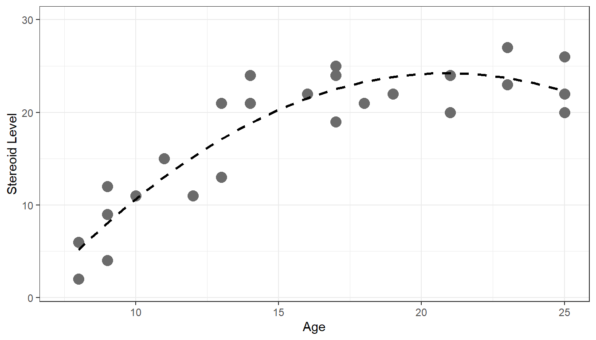
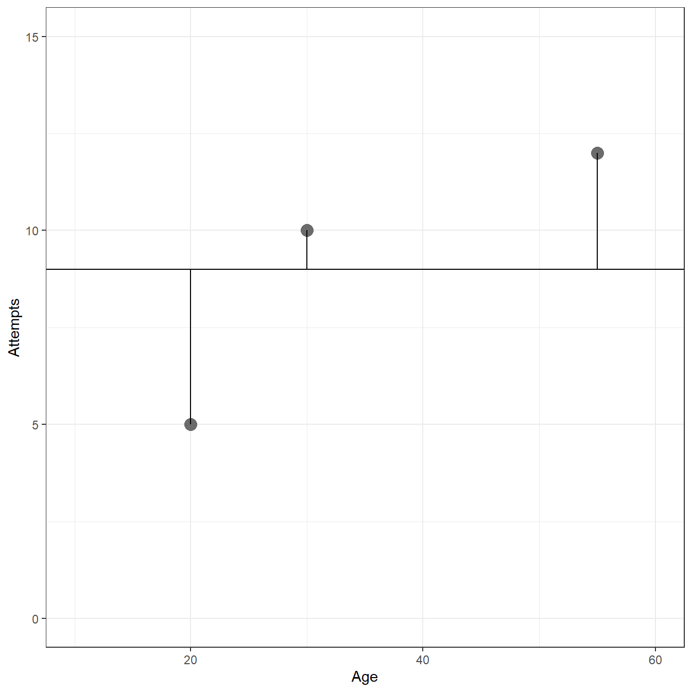
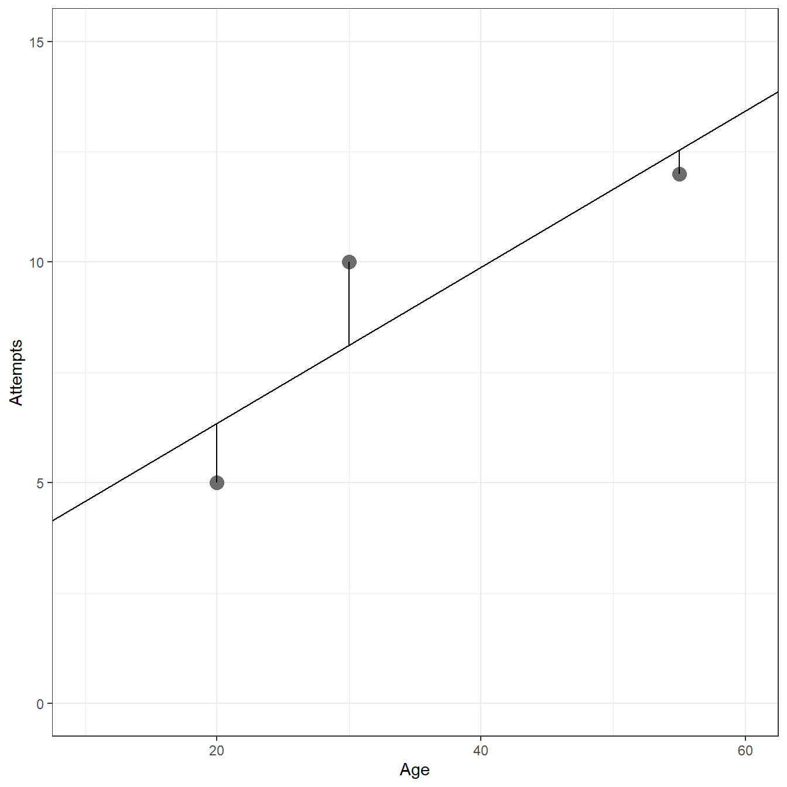
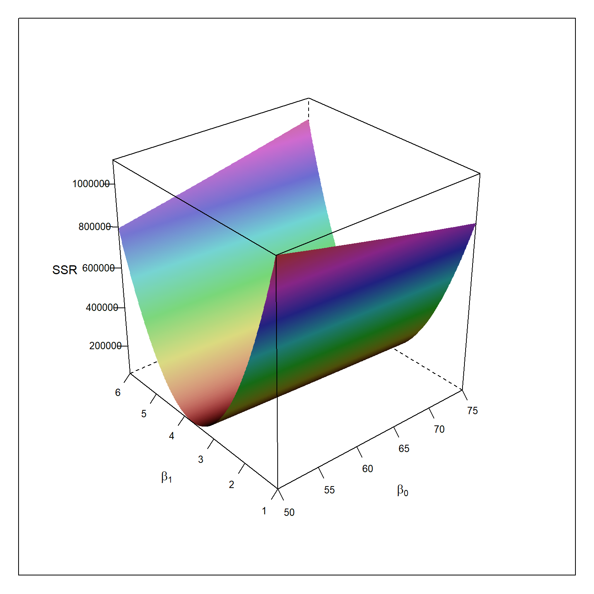

# Linear Regression with One Predictor Variable {#ch1}


## Relations between Variables

### Example 1


```r
require(here)

fig1.2 <- read.csv(here('/data/fig1.2.csv/'),header=FALSE)

require(ggplot2)

ggplot(fig1.2,aes(x=V1,y=V2))+
  geom_point(size=4,col='gray42')+
  geom_smooth(method=lm,se=FALSE,lty=2,col='black')+
  xlim(55,100)+
  ylim(55,100)+
  xlab('Midyear Evaluation')+
  ylab('Year-End Evaluation')+
  theme_bw()
```


### Example 2


```r
fig1.3 <- read.csv(here('/data/fig1.3.csv/'),header=FALSE)

ggplot(fig1.3,aes(x=V1,y=V2))+
  geom_point(size=4,col='gray42')+
  geom_smooth(method=lm,formula = y ~ x + I(x^2), se=FALSE,lty=2,col='black')+
  xlim(7.5,25)+
  ylim(1,30)+
  xlab('Age')+
  ylab('Stereoid Level')+
  theme_bw()
```



## Regression Model an Their Uses

## Simple Linear Regression Model with Distributions of Error Terms Unspecified

### Example (page 10)

$$Y_i = 9.5 + 2.1X_i + \epsilon_i$$

```r
b0 = 9.5
b1 = 2.1
        
x = 0:70
        
mean = b0 + b1*x
    
err.sd = 5
        
  plot(x,mean,type="l",
       ylim=c(40,120),
       xlim=c(10,50),
       cex=1,
       pch=19,
       xlab="Number of Bids Prepared",
       ylab="Hours",
       xaxt='n')
        
  axis(side=1,at=c(0,25,45))
  abline(b0,b1)
        
  dens = dnorm(seq(-3,3,.01),0,1)

  for(i in c(26,46)){
            
    x. = x[i] - 5*dens
    y. = mean[i]+seq(-3,3,.01)*err.sd
    points(x.,y.,type="l",lty=2)
    abline(v=x[i],lty=2,col="gray")
  }
```


## Data for Regression Analysis

## Overview of Steps in Regression Analysis

## Estimation of Regression Function

### Example (page 15)


```r
Age      <- c(20,55,30)
Attempts <- c(5, 12, 10)

fig1.9 <- data.frame(Age=Age,Attempts=Attempts)

ggplot(data= fig1.9, aes(x=Age,y=Attempts))+
	geom_point(size=4,color='gray42')+
	xlim(c(10,60))+
	ylim(c(0,15))+
  theme_bw()+
	geom_hline(yintercept = 9)+
	geom_segment(x = fig1.9[1,1], y = fig1.9[1,2], xend = fig1.9[1,1], yend = 9)+
  geom_segment(x = fig1.9[2,1], y = fig1.9[2,2], xend = fig1.9[2,1], yend = 9)+
  geom_segment(x = fig1.9[3,1], y = fig1.9[3,2], xend = fig1.9[3,1], yend = 9)+
	xlab('Age')+
	ylab('Attempts')
```



```r
# Sum of Squared Deviations 

sum((Attempts - 9)^2)
```

```
[1] 26
```


```r
mod <- lm(Attempts ~ 1 + Age,d=fig1.9)

ggplot(data= fig1.9, aes(x=Age,y=Attempts))+
	geom_point(size=4,color='gray42')+
  geom_abline(intercept = coef(mod)[1],slope=coef(mod)[2])+
	xlim(c(10,60))+
	ylim(c(0,15))+
  theme_bw()+
	geom_segment(x = fig1.9[1,1], y = fig1.9[1,2], xend = fig1.9[1,1], 
	             yend = predict(mod, newdata = data.frame(Age=c(fig1.9[1,1]))))+
	geom_segment(x = fig1.9[2,1], y = fig1.9[2,2], xend = fig1.9[2,1], 
	             yend = predict(mod, newdata = data.frame(Age=c(fig1.9[2,1]))))+
	geom_segment(x = fig1.9[3,1], y = fig1.9[3,2], xend = fig1.9[3,1], 
	             yend = predict(mod, newdata = data.frame(Age=c(fig1.9[3,1]))))+
	xlab('Age')+
	ylab('Attempts')
```



```r
# Model predictions

predict(mod)
```

```
     1      2      3 
 6.346 12.538  8.115 
```

```r
# Model Residuals

resid(mod)
```

```
      1       2       3 
-1.3462 -0.5385  1.8846 
```

```r
# Sum of Squared Deviations 

sum((Attempts - predict(mod))^2)
```

```
[1] 5.654
```

```r
sum(resid(mod)^2)
```

```
[1] 5.654
```

### Example (page 19)


```r
table1.1 <- read.table(here('/data/CH01TA01.txt/'),header=FALSE)

colnames(table1.1) <- c('lot.size','work.hours')

table1.1
```

```
   lot.size work.hours
1        80        399
2        30        121
3        50        221
4        90        376
5        70        361
6        60        224
7       120        546
8        80        352
9       100        353
10       50        157
11       40        160
12       70        252
13       90        389
14       20        113
15      110        435
16      100        420
17       30        212
18       50        268
19       90        377
20      110        421
21       30        273
22       90        468
23       40        244
24       80        342
25       70        323
```


```r
ggplot(table1.1,aes(x=lot.size,y=work.hours))+
  geom_point(size=3,col='gray42')+
  geom_smooth(method=lm,se=FALSE,lty=2,lwd=0.5,col='black')+
  xlim(0,150)+
  ylim(0,600)+
  xlab('Lot Size')+
  ylab('Hours')+
  theme_bw()
```


```r
require(lm.beta)
require(car)

mod <- lm(work.hours ~ 1 + lot.size,d=table1.1)

Anova(mod,type=3)
```

```
Anova Table (Type III tests)

Response: work.hours
            Sum Sq Df F value        Pr(>F)    
(Intercept)  13530  1    5.68         0.026 *  
lot.size    252378  1  105.88 0.00000000044 ***
Residuals    54825 23                          
---
Signif. codes:  0 '***' 0.001 '**' 0.01 '*' 0.05 '.' 0.1 ' ' 1
```

```r
summary(mod)
```

```

Call:
lm(formula = work.hours ~ 1 + lot.size, data = table1.1)

Residuals:
   Min     1Q Median     3Q    Max 
-83.88 -34.09  -5.98  38.83 103.53 

Coefficients:
            Estimate Std. Error t value      Pr(>|t|)    
(Intercept)   62.366     26.177    2.38         0.026 *  
lot.size       3.570      0.347   10.29 0.00000000044 ***
---
Signif. codes:  0 '***' 0.001 '**' 0.01 '*' 0.05 '.' 0.1 ' ' 1

Residual standard error: 48.8 on 23 degrees of freedom
Multiple R-squared:  0.822,	Adjusted R-squared:  0.814 
F-statistic:  106 on 1 and 23 DF,  p-value: 0.000000000445
```

```r
coef(mod)
```

```
(Intercept)    lot.size 
      62.37        3.57 
```


```r
table1.1$x_xbar <- table1.1$lot.size - mean(table1.1$lot.size)
table1.1$y_ybar <- table1.1$work.hours - mean(table1.1$work.hours)
table1.1$x_xbar_y_ybar <- table1.1$x_xbar*table1.1$y_ybar
table1.1$x_xbar.sq <- table1.1$x_xbar^2
table1.1$y_ybar.sq <- table1.1$y_ybar^2

table1.1
```

```
   lot.size work.hours x_xbar  y_ybar x_xbar_y_ybar x_xbar.sq y_ybar.sq
1        80        399     10   86.72         867.2       100    7520.4
2        30        121    -40 -191.28        7651.2      1600   36588.0
3        50        221    -20  -91.28        1825.6       400    8332.0
4        90        376     20   63.72        1274.4       400    4060.2
5        70        361      0   48.72           0.0         0    2373.6
6        60        224    -10  -88.28         882.8       100    7793.4
7       120        546     50  233.72       11686.0      2500   54625.0
8        80        352     10   39.72         397.2       100    1577.7
9       100        353     30   40.72        1221.6       900    1658.1
10       50        157    -20 -155.28        3105.6       400   24111.9
11       40        160    -30 -152.28        4568.4       900   23189.2
12       70        252      0  -60.28           0.0         0    3633.7
13       90        389     20   76.72        1534.4       400    5886.0
14       20        113    -50 -199.28        9964.0      2500   39712.5
15      110        435     40  122.72        4908.8      1600   15060.2
16      100        420     30  107.72        3231.6       900   11603.6
17       30        212    -40 -100.28        4011.2      1600   10056.1
18       50        268    -20  -44.28         885.6       400    1960.7
19       90        377     20   64.72        1294.4       400    4188.7
20      110        421     40  108.72        4348.8      1600   11820.0
21       30        273    -40  -39.28        1571.2      1600    1542.9
22       90        468     20  155.72        3114.4       400   24248.7
23       40        244    -30  -68.28        2048.4       900    4662.2
24       80        342     10   29.72         297.2       100     883.3
25       70        323      0   10.72           0.0         0     114.9
```


```r
b1 = sum(table1.1$x_xbar_y_ybar)/sum(table1.1$x_xbar.sq)
b1
```

```
[1] 3.57
```

```r
b0 = mean(table1.1$work.hours) - b1*mean(table1.1$lot.size)
b0
```

```
[1] 62.37
```


### Example (page 21)

$$ \hat{Y} = 62.37 + 35702*X$$


```r
predict(mod, newdata = data.frame(lot.size=65))
```

```
    1 
294.4 
```

### Table 1.2 (page 22)


```r
table1.1 <- read.table(here('/data/CH01TA01.txt/'),header=FALSE)
colnames(table1.1) <- c('lot.size','work.hours')

mod <- lm(work.hours ~ 1 + lot.size,d=table1.1)

table1.1$predicted <- predict(mod)
table1.1$residuals <- resid(mod)
table1.1$residuals.squared <- resid(mod)^2

table1.1
```

```
   lot.size work.hours predicted residuals residuals.squared
1        80        399     348.0   51.0180         2602.8343
2        30        121     169.5  -48.4719         2349.5270
3        50        221     240.9  -19.8760          395.0538
4        90        376     383.7   -7.6840           59.0445
5        70        361     312.3   48.7200         2373.6384
6        60        224     276.6  -52.5780         2764.4440
7       120        546     490.8   55.2099         3048.1329
8        80        352     348.0    4.0180           16.1442
9       100        353     419.4  -66.3861         4407.1090
10       50        157     240.9  -83.8760         7035.1766
11       40        160     205.2  -45.1739         2040.6848
12       70        252     312.3  -60.2800         3633.6784
13       90        389     383.7    5.3160           28.2594
14       20        113     133.8  -20.7699          431.3887
15      110        435     455.1  -20.0881          403.5310
16      100        420     419.4    0.6139            0.3769
17       30        212     169.5   42.5281         1808.6377
18       50        268     240.9   27.1240          735.7136
19       90        377     383.7   -6.6840           44.6764
20      110        421     455.1  -34.0881         1161.9973
21       30        273     169.5  103.5281        10718.0635
22       90        468     383.7   84.3160         7109.1810
23       40        244     205.2   38.8261         1507.4630
24       80        342     348.0   -5.9820           35.7846
25       70        323     312.3   10.7200          114.9184
```


### Alternative Model with Mean Centering (page 22)


```r
table1.1 <- read.table(here('/data/CH01TA01.txt/'),header=FALSE)
colnames(table1.1) <- c('lot.size','work.hours')

table1.1$lot.size_centered <- table1.1$lot.size - mean(table1.1$lot.size)

mod <- lm(work.hours ~ 1 + lot.size_centered,d=table1.1)

Anova(mod,type=3)
```

```
Anova Table (Type III tests)

Response: work.hours
                   Sum Sq Df F value               Pr(>F)    
(Intercept)       2437970  1    1023 < 0.0000000000000002 ***
lot.size_centered  252378  1     106        0.00000000044 ***
Residuals           54825 23                                 
---
Signif. codes:  0 '***' 0.001 '**' 0.01 '*' 0.05 '.' 0.1 ' ' 1
```

```r
summary(mod)
```

```

Call:
lm(formula = work.hours ~ 1 + lot.size_centered, data = table1.1)

Residuals:
   Min     1Q Median     3Q    Max 
-83.88 -34.09  -5.98  38.83 103.53 

Coefficients:
                  Estimate Std. Error t value             Pr(>|t|)    
(Intercept)        312.280      9.765    32.0 < 0.0000000000000002 ***
lot.size_centered    3.570      0.347    10.3        0.00000000044 ***
---
Signif. codes:  0 '***' 0.001 '**' 0.01 '*' 0.05 '.' 0.1 ' ' 1

Residual standard error: 48.8 on 23 degrees of freedom
Multiple R-squared:  0.822,	Adjusted R-squared:  0.814 
F-statistic:  106 on 1 and 23 DF,  p-value: 0.000000000445
```

```r
coef(mod)
```

```
      (Intercept) lot.size_centered 
           312.28              3.57 
```

## Estimation of Error Terms Variance


```r
table1.1 <- read.table(here('/data/CH01TA01.txt/'),header=FALSE)
colnames(table1.1) <- c('lot.size','work.hours')

mod <- lm(work.hours ~ 1 + lot.size,d=table1.1)

table1.1$predicted <- predict(mod)
table1.1$residuals <- resid(mod)
table1.1$residuals.squared <- resid(mod)^2

sse = sum(table1.1$residuals.squared)
sse
```

```
[1] 54825
```

```r
mse = sum(table1.1$residuals.squared)/(nrow(table1.1)-2)
mse 
```

```
[1] 2384
```

```r
sqrt(mse)
```

```
[1] 48.82
```

## Normal Error Regression Model

### Least Square Estimation


```r
table1.1 <- read.table(here('/data/CH01TA01.txt/'),header=FALSE)
colnames(table1.1) <- c('lot.size','work.hours')

beta0 <- seq(50,75,.1)
beta1 <- seq(1,6,.01)

ols <- expand.grid(beta0,beta1)
colnames(ols) <- c('beta0','beta1')
ols$ssr <- NA

for(i in 1:nrow(ols)){
	p = ols[i,1] + ols[i,2]*table1.1$lot.size
	ols[i,3] = sum((table1.1$work.hours - p)^2)
}

require(lattice)

wireframe(ssr ~ beta0 * beta1,
          data = ols,
          shade=TRUE,
          screen = list(z = 40, x = -60, y=0),
	    scales = list(arrows=FALSE),
	    xlab = expression(beta[0]), 
	    ylab = expression(beta[1]), 
	    zlab = "SSR")

ols[which.min(ols$ssr),]
```


```
      beta0 beta1   ssr
64632  62.4  3.57 54825
```



### Maximum Likelihood Estimation


```r
table1.1 <- read.table(here('/data/CH01TA01.txt/'),header=FALSE)
colnames(table1.1) <- c('lot.size','work.hours')

beta0 <- seq(50,75,.1)
beta1 <- seq(1,6,.01)

mle <- expand.grid(beta0,beta1)
colnames(mle) <- c('beta0','beta1')
mle$loglikelihood <- NA

mse = 2383 # assumed to be known

for(i in 1:nrow(mle)){
	p = ols[i,1] + ols[i,2]*table1.1$lot.size
	mle[i,3] = 	sum(log(dnorm((table1.1$work.hours - p)/sqrt(mse))))
}

wireframe(loglikelihood ~ beta0 * beta1,
          data = mle,
          shade=TRUE,
          screen = list(z = 40, x = -60, y=0),
          scales = list(arrows=FALSE),
          xlab = expression(beta[0]), 
          ylab = expression(beta[1]), 
          zlab = "Loglikelihood")

mle[which.max(mle$loglikelihood),]
```


```
      beta0 beta1 loglikelihood
64632  62.4  3.57        -34.48
```


## Problems


